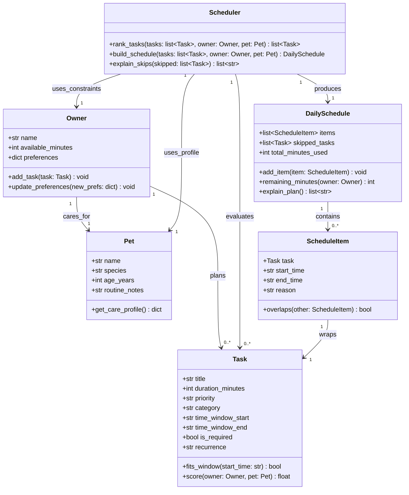

# PawPal+ UML Class Diagram

```mermaid
classDiagram
    class Owner {
        +str name
        +int available_minutes
        +dict preferences
        +add_task(task: Task) void
        +update_preferences(new_prefs: dict) void
    }

    class Pet {
        +str name
        +str species
        +int age_years
        +str routine_notes
        +get_care_profile() dict
    }

    class Task {
        +str title
        +int duration_minutes
        +str priority
        +str category
        +str time_window_start
        +str time_window_end
        +bool is_required
        +str recurrence
        +fits_window(start_time: str) bool
        +score(owner: Owner, pet: Pet) float
    }

    class ScheduleItem {
        +Task task
        +str start_time
        +str end_time
        +str reason
        +overlaps(other: ScheduleItem) bool
    }

    class DailySchedule {
        +list~ScheduleItem~ items
        +list~Task~ skipped_tasks
        +int total_minutes_used
        +add_item(item: ScheduleItem) void
        +remaining_minutes(owner: Owner) int
        +explain_plan() list~str~
    }

    class Scheduler {
        +rank_tasks(tasks: list~Task~, owner: Owner, pet: Pet) list~Task~
        +build_schedule(tasks: list~Task~, owner: Owner, pet: Pet) DailySchedule
        +explain_skips(skipped: list~Task~) list~str~
    }

    Owner "1" --> "1" Pet : cares_for
    Owner "1" --> "0..*" Task : plans
    Scheduler "1" --> "1" Owner : uses_constraints
    Scheduler "1" --> "1" Pet : uses_profile
    Scheduler "1" --> "0..*" Task : evaluates
    Scheduler "1" --> "1" DailySchedule : produces
    DailySchedule "1" --> "0..*" ScheduleItem : contains
    ScheduleItem "1" --> "1" Task : wraps
```
